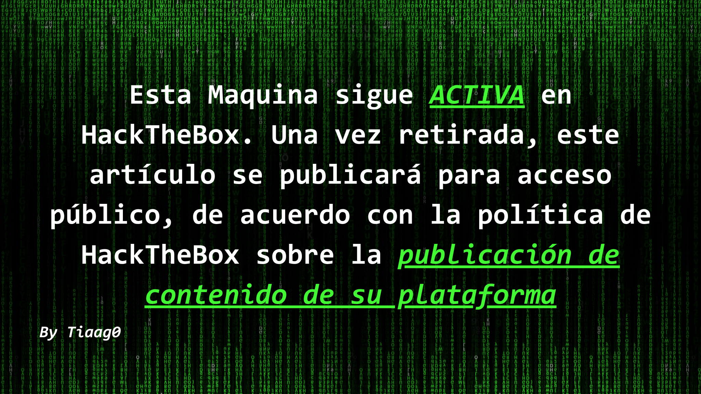

En este tutorial, te mostraré cómo logré obtener el control total sobre la maquina "CodePartTwo" en HackTheBox Season 9.

## Escaneo Nmap
```bash
┌──(root㉿tiaago)-[/home/secbytiago/Descargas]
└─# nmap -sV -sC -A 10.10.11.82
Starting Nmap 7.95 ( https://nmap.org ) at 2025-10-27 15:03 -03
Nmap scan report for 10.10.11.82
Host is up (0.20s latency).
Not shown: 998 closed tcp ports (reset)
PORT     STATE SERVICE VERSION
22/tcp   open  ssh     OpenSSH 8.2p1 Ubuntu 4ubuntu0.13 (Ubuntu Linux; protocol 2.0)
| ssh-hostkey: 
|   3072 a0:47:b4:0c:69:67:93:3a:f9:b4:5d:b3:2f:bc:9e:23 (RSA)
|   256 7d:44:3f:f1:b1:e2:bb:3d:91:d5:da:58:0f:51:e5:ad (ECDSA)
|_  256 f1:6b:1d:36:18:06:7a:05:3f:07:57:e1:ef:86:b4:85 (ED25519)
8000/tcp open  http    Gunicorn 20.0.4
|_http-title: Welcome to CodePartTwo
|_http-server-header: gunicorn/20.0.4
Device type: general purpose
Running: Linux 4.X|5.X
OS CPE: cpe:/o:linux:linux_kernel:4 cpe:/o:linux:linux_kernel:5
OS details: Linux 4.15 - 5.19
Network Distance: 2 hops
Service Info: OS: Linux; CPE: cpe:/o:linux:linux_kernel

TRACEROUTE (using port 110/tcp)
HOP RTT       ADDRESS
1   484.20 ms 10.10.14.1
2   484.32 ms 10.10.11.82

OS and Service detection performed. Please report any incorrect results at https://nmap.org/submit/ .
Nmap done: 1 IP address (1 host up) scanned in 17.80 seconds
```

## Archivo Descargado App.zip
```bash
┌──(root㉿tiaago)-[/home/secbytiago/Descargas/app]
└─# tree -f   
.
├── ./app.py
├── ./instance
│   └── ./instance/users.db
├── ./requirements.txt
├── ./static
│   ├── ./static/css
│   │   └── ./static/css/styles.css
│   └── ./static/js
│       └── ./static/js/script.js
└── ./templates
    ├── ./templates/base.html
    ├── ./templates/dashboard.html
    ├── ./templates/index.html
    ├── ./templates/login.html
    ├── ./templates/register.html
    └── ./templates/reviews.html
6 directories, 11 files
```



<!-- ```bash
┌──(root㉿tiaago)-[/home/secbytiago/Descargas/app]
└─# tree -f   
.
├── ./app.py
├── ./instance
│   └── ./instance/users.db
├── ./requirements.txt
├── ./static
│   ├── ./static/css
│   │   └── ./static/css/styles.css
│   └── ./static/js
│       └── ./static/js/script.js
└── ./templates
    ├── ./templates/base.html
    ├── ./templates/dashboard.html
    ├── ./templates/index.html
    ├── ./templates/login.html
    ├── ./templates/register.html
    └── ./templates/reviews.html
6 directories, 11 files
``` -->

